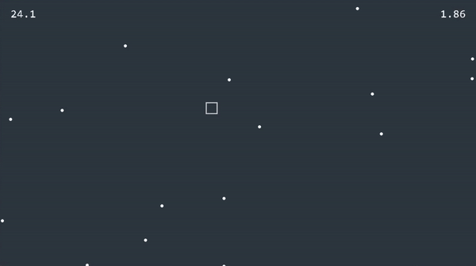

<div align="center">


An endless survival game where players must dodge obstacles while contending with unpredictable gravity, which restricts their movement.



</div>

## 🛠️ How To Build

```
cmake ..
cmake --build .

./bin/main
```

---

<div align="center">
  Copyright &#169; 2022 PyroWilDx. All Rights Reserved.
</div>
